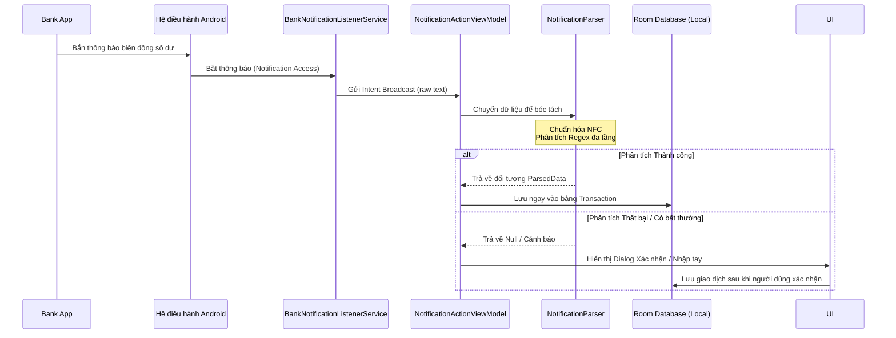
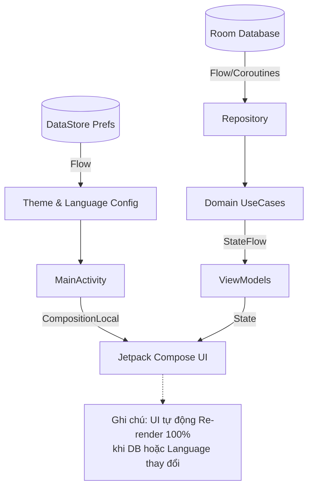

# Simple Expense Tracker

Ứng dụng quản lý chi tiêu đơn giản, tự động đọc thông báo biến động số dư từ ứng dụng ngân hàng để ghi chú giao dịch hoàn toàn offline.

## 🌟 Tính năng chính

- **Tự động bắt thông báo:** Sử dụng `BankNotificationListenerService` lắng nghe biến động số dư từ các ứng dụng ngân hàng/ví điện tử (Vietcombank, Techcombank, MB Bank, TNEX, Momo, v.v.).
- **Phân tích thông minh:** Bộ phân tích (Parser) linh hoạt bằng Regex đọc trực tiếp từ JSON, hỗ trợ cập nhật động cấu hình nhận diện ngân hàng mà không cần build lại app.
- **Quản lý đa tài khoản:** Hỗ trợ thống kê giao dịch theo từng tài khoản ngân hàng riêng biệt.
- **Hoàn toàn Offline & Bảo mật:** Dữ liệu giao dịch được lưu hoàn toàn trên bộ nhớ thiết bị của bạn thông qua Room Database. Không có bất kỳ kết nối gửi dữ liệu nào lên server (No Backend) để bảo vệ tính riêng tư.
- **Giao diện hiện đại & mượt mà:**
  - Xây dựng 100% bằng Jetpack Compose.
  - Sử dụng hệ thống Double Navigation Drawers (Menu Cài đặt bên trái, Panel Thông báo bên phải).
  - Hỗ trợ chế độ Custom Dark Theme độc quyền.
- **Đa ngôn ngữ trực tiếp (Kotlin thuần):** Quản lý chuỗi thông qua `CompositionLocal` thay vì `strings.xml`, cho phép chuyển đổi ngôn ngữ ứng dụng tức thì mà không cần khởi động lại Activity.

## 🛠 Ngôn ngữ & Công nghệ

- **Ngôn ngữ:** Kotlin
- **Kiến trúc:** Clean Architecture + MVVM
- **UI Framework:** Jetpack Compose (100%)
- **Dependency Injection:** Dagger Hilt
- **Local Storage:** Room Database (Lưu trữ giao dịch), DataStore Preferences (Cài đặt, Ngôn ngữ, Theme)
- **Background Processing:** NotificationListenerService
- **Asynchronous Programming:** Coroutines & StateFlow

## 🏗 Cấu trúc Dự án (Architecture)

Dự án tuân theo mô hình **Clean Architecture** để đảm bảo tính phân tách mã nguồn và dễ mở rộng, bao gồm các package chính:

- `di/`: Các Module Dependency Injection bằng Hilt cung cấp App, DB, DataStore, Repository.
- `data/`: Tầng dữ liệu chứa Local Database (Room), DAOs, Entity, Mapper và Repository Implementations.
- `domain/`: Tầng nghiệp vụ cốt lõi chứa Domain Models, UseCases, Interfaces, cấu hình hệ thống (`ConfigManager`) và `NotificationParser`.
- `ui/`: Tầng giao diện chứa các thành phần Compose UI (Dashboard, Ledger, Notification, Settings, Theme).
- `service/`: Tầng Background Service chạy ngầm bắt và xử lý thông báo.

## 🔄 Sơ đồ Luồng (Flow Diagrams)

### 1. Luồng Bắt & Phân tích Thông báo Ngân hàng
Sơ đồ dưới đây mô tả quá trình từ khi điện thoại nhận được biến động số dư đến khi giao dịch được lưu vào cơ sở dữ liệu:



### 2. Luồng Hiển thị Dữ liệu & Đa Ngôn ngữ (UI Flow)
Hệ thống sử dụng Reactive Programming (Flow) để cập nhật giao diện theo thời gian thực:



## 🚀 Cài đặt & Chạy ứng dụng

1. Clone kho lưu trữ này về máy:
   ```bash
   git clone https://github.com/Thethien2k5/Simple-Expense-Tracker.git
   ```
2. Mở dự án bằng **Android Studio** (Phiên bản mới nhất hỗ trợ Kotlin mới và Jetpack Compose).
3. Đợi Gradle đồng bộ (Sync) và tải về các thư viện cần thiết.
4. Chạy ứng dụng trên máy ảo (Emulator) hoặc thiết bị Android thật.

> **Lưu ý Cấp quyền:** Lần đầu mở app, ứng dụng sẽ yêu cầu quyền đọc thông báo (Notification Access). Vui lòng cấp quyền này trong Cài đặt hệ thống để tính năng tự động lắng nghe và phân tích các giao dịch ngân hàng có thể hoạt động.

## 📅 Lộ trình phát triển (Roadmap)

- [x] Thiết lập cấu trúc dự án chuẩn Clean Architecture, MVVM, Room, Hilt.
- [x] Phát triển giao diện UI 100% bằng Jetpack Compose với Double Drawers.
- [x] Cài đặt `BankNotificationListenerService` & parser tự động sử dụng Regex.
- [x] Cơ chế cấu hình Parser động thông qua `ConfigManager` lưu trữ JSON.
- [x] Quản lý Đa ngôn ngữ và Theme bằng `CompositionLocal`.
- [x] Tích hợp tính năng tự động chuẩn hóa Unicode khi quét Regex. 
- [ ] Tích hợp AI (Gemini Nano hoặc LLM nhẹ) vào `NotificationParser` để tự động bóc tách nội dung giao dịch thông minh hơn nếu Regex truyền thống thất bại. *(Phương án này đã bị loại bỏ trong quá trình phát triển)*


